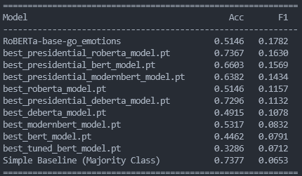

# NLP Final Project - Emotion Classification with BERT

Models: The models are too big in size, so they are included in the Google Drive folder found here:
[https://drive.google.com/drive/folders/1cAxlNEXwFEmKOICnVLyKcmT-ZgmZA4ZX?usp=sharing](https://drive.google.com/drive/folders/1cAxlNEXwFEmKOICnVLyKcmT-ZgmZA4ZX?usp=sharing)

## Project Structure

```
NLPFinalProject/
├── README.md
├── data/                    # Training/dev/test data splits
│   ├── README.md            # Data documentation
│   └── presidential_speeches_goemotions_labeled.csv
├── code/                    # All project code
│   ├── README.md            # Step-by-step instructions
│   ├── bert.ipynb           # BERT training notebook
│   ├── roberta.ipynb        # RoBERTa training notebook
│   ├── deberta.ipynb        # DeBERTa training notebook
│   ├── modernbert.ipynb     # ModernBERT training notebook
│   ├── evaluate.py          # Evaluation script
│   ├── evalGoEmo.py         # GoEmotions test evaluation
│   └── ...                  # Other code files
└── output/                  # Model predictions and results
    ├── README.md            # Output documentation with eval commands
    ├── *.pt                 # Trained model files
    └── *.csv                # Evaluation results
```

## Quick Start

### Run Evaluation Script

**We got permission from Dr. Yatskar to change our eval script inputs**

```bash
cd code/
python evaluate.py ../output/best_bert_model.pt
```

The eval script compares our majority baseline model, to the GoEmotions trained model from the research paper, to our own trained BERT model.

### Labeling Dataset

Run `code/label_presidential.ipynb` to label and save our dataset with pretrained GoEmotions model.

## Results



## Steps to Run the Code

1. Run `code/label_presidential.ipynb` to label the presidential dataset
2. Run `code/bert.ipynb` to train the custom BERT model
3. Run `python code/evaluate.py output/best_bert_model.pt` to evaluate the models against the presidential dataset

See `code/README.md` for detailed step-by-step instructions and command line examples.
